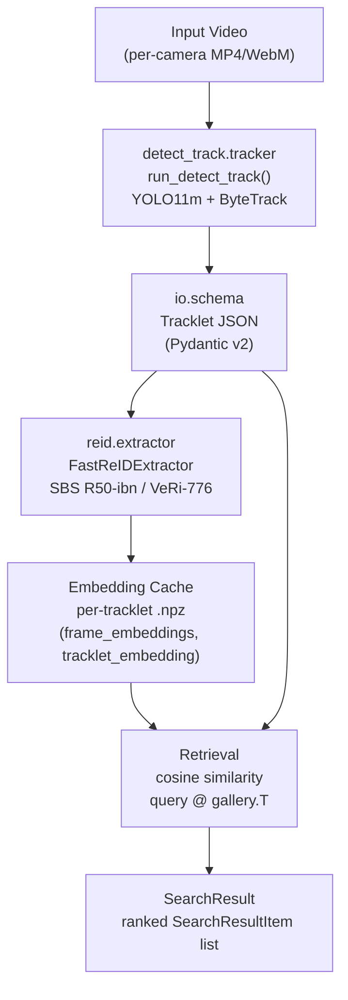

# Architecture

## Module Pipeline



### Notes
- **CPU-only inference** at M1–M2 (torch+cpu build on GTX 1650; CUDA build pending).
- All inter-module data passes through the schema layer — no module imports another module directly.
- Embedding cache is write-once per tracklet per model version; re-run `retrieval_demo.py` after deleting `outputs/cache/` to force recomputation.

---

## Schema Interfaces

All schemas live in [`src/incident_search/io/schema.py`](../src/incident_search/io/schema.py).
They use **Pydantic v2** with `extra="forbid"` to catch stray fields early.

### `Camera`
| Field | Type | Description |
|---|---|---|
| `camera_id` | `str` | Unique ID (e.g. `c001`) |
| `video_paths` | `list[str]` | Video file paths |
| `fps` | `float` | Frames per second (default 30.0) |
| `time_offset_s` | `float` | Sync offset relative to global clock |
| `location` | `dict[str,float] \| None` | Optional GPS/map coordinates |

### `Tracklet`
| Field | Type | Description |
|---|---|---|
| `tracklet_id` | `str` | `<camera_id>_trk<N>` |
| `camera_id` | `str` | Source camera |
| `start_time_s` | `float` | Global timestamp of first frame |
| `end_time_s` | `float` | Global timestamp of last frame |
| `frames` | `list[int]` | Frame indices in camera video |
| `boxes` | `list[list[float]]` | `[[x1,y1,x2,y2]]` pixel coords |
| `scores` | `list[float]` | Per-frame detection confidence |
| `vehicle_class` | `str` | `car \| bus \| truck \| motorcycle` |
| `gt_vehicle_id` | `str \| None` | Ground-truth ID (eval only) |
| `crop_paths` | `list[str]` | Sampled crop file paths |

### `EmbeddingRecord`
| Field | Type | Description |
|---|---|---|
| `tracklet_id` | `str` | Associated tracklet |
| `model_name` | `str` | Backbone architecture name |
| `model_version` | `str` | Checkpoint identifier |
| `embedding_dim` | `int` | Feature dimension (2048 for R50-ibn) |
| `embedding_path` | `str \| None` | Path to `.npz` cache file |

### `SearchQuery`
| Field | Type | Description |
|---|---|---|
| `query_camera_id` | `str` | Camera where incident was observed |
| `query_time_s` | `float` | Global incident time |
| `query_tracklet_id` | `str \| None` | Optional linked tracklet |
| `crop_path` | `str \| None` | Single-crop query alternative |
| `gt_vehicle_id` | `str \| None` | Ground truth (eval only) |

### `SearchResultItem`
| Field | Type | Description |
|---|---|---|
| `tracklet_id` | `str` | Retrieved tracklet |
| `score` | `float` | Final combined score |
| `appearance_score` | `float` | Cosine similarity of re-ID embeddings |
| `prior_score` | `float` | Spatio-temporal prior (0.0 at M2) |
| `camera_id` | `str` | Source camera of candidate |
| `start_time_s` | `float` | Start time of candidate |
| `end_time_s` | `float` | End time of candidate |
| `crop_paths` | `list[str]` | Thumbnails for display |

### `SearchResult`
| Field | Type | Description |
|---|---|---|
| `results` | `list[SearchResultItem]` | Ranked list, descending score |
| `candidates_before_pruning` | `int` | Pool size before window/graph filter |
| `candidates_after_pruning` | `int` | Pool size after filter |
| `mode` | `str` | `appearance_only \| appearance_window \| appearance_graph_prior` |

### `Incident`
| Field | Type | Description |
|---|---|---|
| `incident_id` | `str` | Unique event identifier |
| `camera_id` | `str` | Camera where event occurred |
| `time_s` | `float` | Global event timestamp |
| `involved_tracklet_ids` | `list[str]` | Participating tracklets |
| `confidence` | `float` | Detector confidence ∈ [0,1] |
| `description` | `str \| None` | Optional human-readable note |

---

## Embedding Cache Format

Each tracklet embedding is stored as a compressed NumPy archive:

```
outputs/cache/embeddings/sbs_R50-ibn/<tracklet_id>.npz
    frame_embeddings   float32  [N, 2048]   L2-normed per-crop features
    tracklet_embedding float32  [2048]      mean-pooled, re-normalized tracklet vector
```

---

## Decisions Log

| # | Decision | Rationale | Alternatives Considered |
|---|---|---|---|
| D-1 | **FastReID installed `--no-deps`** | PyPI `fastreid==1.4.0` pins `torch==1.13.1`, which does not ship wheels for Python 3.13. Installing without deps and relying on the already-installed `torch>=2.0` works because fastreid's Python code is pure-Python and API-compatible. | (a) Fork and patch `setup.cfg`; (b) use a Docker container with Python 3.10 — both add maintenance burden. |
| D-2 | **YOLO11m + ByteTrack via Ultralytics** | Single-line tracking API; auto-downloads weights; ByteTrack supports multi-class tracking; `lap` auto-installed on first run. | StrongSORT (heavier), DeepSORT (needs separate re-ID at track stage). |
| D-3 | **COCO class IDs {2,3,5,7} for vehicles** | Verified from `model.names` dict on live YOLO11m model: 2=car, 3=motorcycle, 5=bus, 7=truck. | Filtering by class name string (fragile to model version changes). |
| D-4 | **Pydantic v2 with `extra="forbid"`** | Catches schema drift between modules early at runtime; JSON round-trip via `model_dump_json` / `model_validate_json`. | dataclasses (no built-in validation); attrs (extra dependency). |
| D-5 | **Mean-pool tracklet embedding** | Simple, parameter-free, shown competitive with attention-based aggregation on short tracklets in literature. | Max-pool; attention-weighted; temporal LSTM. |
| D-6 | **Pure NumPy cosine similarity (no approximate indexing)** | The research compares appearance ranking and candidate pruning effects. Approximate nearest-neighbor search would add another experimental variable and is not needed for the expected gallery sizes. | FAISS flat indexing is deliberately out of scope unless a later, separate scalability ablation is approved. |
| D-7 | **CPU-only inference** | `torch+cpu` build installed; GTX 1650 CUDA 13.2 driver present but no matching CUDA-enabled PyTorch wheel was installed at M0. Re-ID inference takes ~2 s/crop on CPU which is acceptable for a demo gallery of 48 images. | Install `torch+cu121` (requires uninstall/reinstall; deferred to M3). |
